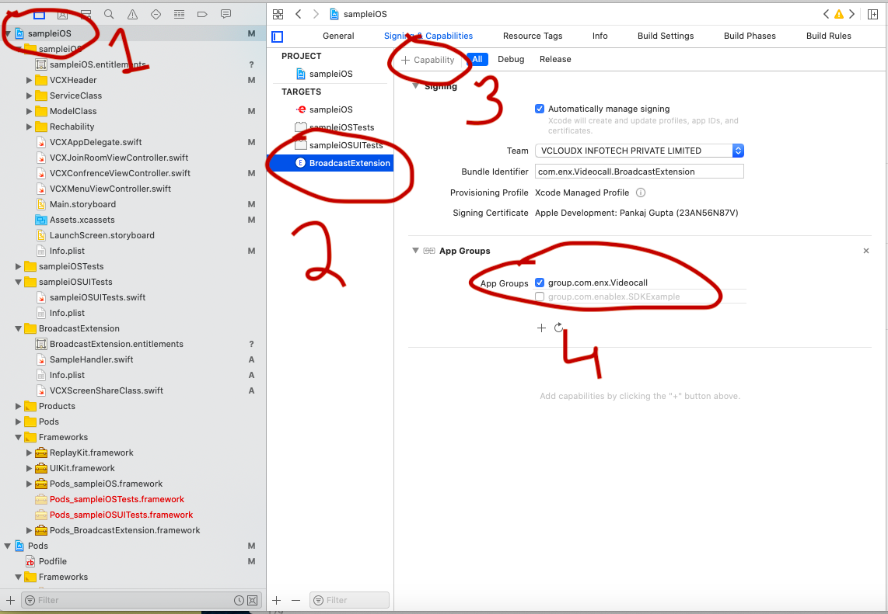

# 1-to-1 RTC: A Sample iOS App with EnableX iOS Toolkit

The sample iOS App demonstrates the use of EnableX (https://www.enablex.io/cpaas/video-api) platform Server APIs and iOS Toolkit to build 1-to-1 RTC (Real Time Communication) Application. It allows developers to ramp up on app development by hosting on their own devices.

This App creates a virtual Room on the fly hosted on the Enablex platform using REST calls and uses the Room credentials (i.e. Room Id) to connect to the virtual Room as a Moderator or Participant using a mobile client. The same Room credentials can be shared with others to join the same virtual Room to carry out a RTC (Real Time Communication) session.

EnableX Developer Center: https://developer.enablex.io/


## 1. How to get started

### 1.1 Pre-Requisites

#### 1.1.1 App Id and App Key 

* Register with EnableX [https://portal.enablex.io/cpaas/trial-sign-up/] 
* Login to the EnableX Portal
* Create your Application Key
* Get your App ID and App Key delivered to your Email


#### 1.1.2 Sample iOS Client 

* Clone or download this Repository [https://github.com/EnableX/One-to-One-Video-Chat-With-Screen-Share-Webrtc-Application-Sample-for-iOS.git] 

#### 1.1.3 Test Application Server

You need to setup an Application Server to provision Web Service API for your iOS Application to communicate enabling Video Session. 

To help you to try our iOS Application quickly, without having to setup Applciation Server, this Application is shipped pre-configured to work in a "try" mode with EnableX hosted Application Server i.e. https://demo.enablex.io. 

Our Application Server restricts a single Session Duation to 10 minutes, and allows 1 moderator and note more than 1 Participant in a Session.

Once you tried EnableX iOS Sample Application, you may need to setup your own  Application Server and verify your Application to work with your Application Server.  More on this, read Point 2 later in the Document.

#### 1.1.4 Configure iOS Client 


* Open the App
* Go to VCXConstant.swift and change the following:
``` 
 /* To try the App with Enablex Hosted Service you need to set the kTry = true
 When you setup your own Application Service, set kTry = false */
 let kTry = true

 /* Your Web Service Host URL. Keet the defined host when kTry = true */
 let kBasedURL = "https://demo.enablex.io/"
     
 /* Your Application Credential required to try with EnableX Hosted Service
 When you setup your own Application Service, remove these */
 let kAppId    = ""
 let kAppkey   = ""
 ```
 
 Note: The distributable comes with demo username and password for the Service. 

### 1.2 Test

#### 1.2.1 Open the App

* Open the App in your Device. You get a form to enter Credentials i.e. Name & Room Id.
* You need to create a Room by clicking the "Create Room" button.
* Once the Room Id is created, you can use it and share with others to connect to the Virtual Room to carry out a RTC Session either as a Moderator or a Participant (Choose applicable Role in the Form).

Note: Only one user with Moderator Role allowed to connect to a Virtual Room while trying with EnableX Hosted Service. Your Own Application Server may allow upto 5 Moderators.
 
Note:- If you used any emulator/simulator your local stream will not create. It will create only on real device.

## 2 Setup Your Own Application Server

You may need to setup your own Application Server after you tried the Sample Application with EnableX hosted Server. We have differnt variant of Appliciation Server Sample Code, pick one in your preferred language and follow instructions given in respective README.md file.

*NodeJS: [https://github.com/EnableX/Video-Conferencing-Open-Source-Web-Application-Sample.git]
*PHP: [https://github.com/EnableX/Group-Video-Call-Conferencing-Sample-Application-in-PHP]

Note the following:

* You need to use App ID and App Key to run this Service.
* Your iOS Client End Point needs to connect to this Service to create Virtual Room and Create Token to join session.
* Application Server is created using EnableX Server API, a Rest API Service helps in provisioning, session access and pos-session reporting.  

To know more about Server API, go to:
https://developer.enablex.io/latest/server-api/


## 3 iOS Toolkit

This Sample Applcation uses EnableX iOS Toolkit to communicate with EnableX Servers to initiate and manage Real Time Communications. You might need to update your Application with latest version of EnableX iOS Toolkit time as and when a new release is avaialble.   

* Documentation: https://developer.enablex.io/latest/client-api/ios-toolkit/
* Download Toolkit: https://developer.enablex.io/resources/downloads/#ios-toolkit

## 4 Application Walk-through

### 4.1 Create Token

We create a Token for a Room Id to get connected to EnableX Platform to connect to the Virtual Room to carry out a RTC Session.

To create Token, we make use of Server API. Refer following documentation:
https://developer.enablex.io/latest/server-api/rooms-route/#create-token


### 4.2 Connect to a Room, Initiate & Publish Stream

We use the Token to get connected to the Virtual Room. Once connected, we intiate local stream and publish into the room. Refer following documentation for this process:
https://developer.enablex.io/latest/client-api/ios-toolkit/enxrtc/


### 4.3 Play Stream

We play the Stream into EnxPlayerView Object.
``` 
let streamView = EnxPlayerView(frame: CGRect) 
self.view.addSubview(streamView) 
localStream.attachRenderer(streamView) 
  ```
More on Player: https://developer.enablex.io/latest/client-api/ios-toolkit/basic-functions/#play-stream

### 4.4 Handle Server Events

EnableX Platform will emit back many events related to the ongoing RTC Session as and when they occur implicitly or explicitly as a result of user interaction. We use delegates of handle all such events.

``` 
/* Example of Delegates */

/* Delegate: didConnect 
Handles successful connection to the Virtual Room */ 

func room(_ room: EnxRoom?, didConnect roomMetadata: [AnyHashable : Any]?) { 
    /* You may initiate and publish your stream here */
} 


/* Delegate: didError
 Error handler when room connection fails */
 
func room(_ room: EnxRoom?, didError reason: String?) { 

} 

 
/* Delegate: didAddedStream
 To handle any new stream added to the Virtual Room */
 
func room(_ room: EnxRoom?, didAddedStream stream: EnxStream?) { 
    /* Subscribe Remote Stream */
} 

/* Delegate: activeTalkerList
 To handle any time Active Talker list is updated */
  
func room(_ room: EnxRoom?, activeTalkerList Data: [Any]?) { 
    /* Handle Stream Players */
}
func didRoomDisconnect(_ response: [Any]?) {
    /* Handel UI once you disconnected with enablex room */
}

```
### 4.5 Screen Share Warm Up
## Note:- Screen share feature will once compile and run on real device, Simulatore will not work
    
The screen sharing feature is a little bit tricky in iOS due to the strict screen capturing policies from Apple. 
To Start screen share follow these steps :-
### Step 1 Add Screen Share Trage
``` 
    Go To -> Project -> File -> Traget -> Broadcast Upload Extension
    Set the bundle ID for Broadcast traget Exm:- com.companyName.Appname.Broadcast.extension
    
```
  

### Step 2 Add App Gorups
 ```
 Add app groups to your project traget and extension traget. 
 Here app group required to exchanges required data from app to extension or vice versa.
 ```       
 


       
### Step 3 Set the stream ID of screen share owner, before start screen share to Enablex SDK

### In Objective- c
        NSUserDefaults *userDefault = [[NSUserDefaults alloc]initWithSuiteName:@"group.com.enx.Videocall"];
            [userDefault setObject:_localStream.streamId forKey:@"ClientID"];
                [userDefault synchronize];
                [[EnxUtilityManager shareInstance] setAppGroupsName:@"group.com.enx.Videocall" withUserKey:@"ClientID"];

### In Swift
            let defau = UserDefaults(suiteName: "group.com.enx.Videocall")
            defau?.set(localStream.streamId, forKey: "ClientID")
            EnxUtilityManager.shareInstance()?.setAppGroupsName("group.com.enx.Videocall", withUserKey: "ClientID")

    
### How to broadcast Screen :- Here in this example we are using RPSystemBroadcastPickerView
### In Objective- c
        RPSystemBroadcastPickerView *pickerView = [[RPSystemBroadcastPickerView alloc]initWithFrame:CGRectMake(0, 0, 50, 50)];
        pickerView.translatesAutoresizingMaskIntoConstraints = false;
        pickerView.autoresizingMask = (UIViewAutoresizingFlexibleTopMargin | UIViewAutoresizingFlexibleRightMargin);
        NSURL *url = [[NSBundle mainBundle] URLForResource:@"BroadCastExtension" withExtension:@"appex" subdirectory:@"PlugIns"];
        if(url != nil){
            NSBundle *bundle = [NSBundle bundleWithURL:url];
            if(bundle != nil){
                pickerView.preferredExtension= bundle.bundleIdentifier;
            }
        }
        pickerView.hidden = true;
        pickerView.showsMicrophoneButton = false;
        SEL buttonPress = NSSelectorFromString(@"buttonPressed:");
        if ([pickerView respondsToSelector:buttonPress]){
            [pickerView performSelector:buttonPress withObject:nil];
        }
        [self.view addSubview:pickerView];
        [self.view bringSubviewToFront:pickerView];
        pickerView.center = self.view.center;

### In Swift
            let broadCast = RPSystemBroadcastPickerView(frame: CGRect(x: 0, y: 0, width: 50, height: 50))
            broadCast.autoresizingMask = [.flexibleTopMargin, .flexibleRightMargin]
            
            if let url = Bundle.main.url(forResource: "BroadcastExtension", withExtension: "appex", subdirectory: "PlugIns") {
                if let bundle = Bundle(url: url) {
                    broadCast.preferredExtension = bundle.bundleIdentifier
                }
            }
            broadCast.isHidden = true
            broadCast.showsMicrophoneButton = false
            let buttonPress = NSSelectorFromString("buttonPressed:")
             if broadCast.responds(to: buttonPress) {
                broadCast.perform(buttonPress, with: nil)
            }
            self.view.addSubview(broadCast)
            self.view.bringSubviewToFront(broadCast)
            broadCast.center = self.view.center

### Handle screen share Dalegate methods
        
### Objective - c
            // Strat screen share acknowledgment 
        -(void)room:(EnxRoom *)room didStartScreenShareACK:(NSArray * _Nullable)Data{
            // Owner of the start screen share will receive this delegate method
        }
        // Stop screen share acknowledgment 
        -(void)room:(EnxRoom *)room didStoppedScreenShareACK:(NSArray * _Nullable)Data{
            // Owner of the stop screen share will receive this delegate method
        }
        // Screen share started 
        -(void)room:(EnxRoom *)room didScreenShareStarted:(EnxStream *)stream{
        // Other participant in same room will receive delegate method for with strat screen share details. 
        }
        // Screen share Stoped 
        -(void)room:(EnxRoom *)room didScreenShareStopped:(EnxStream *)stream{
           // Other participant in same room will receive delegate method for with stop screen share details.
        }
### In Swift
    // Strat screen share acknowledgment 
        func room(_ room: EnxRoom?, didStartScreenShareACK data: [Any]?) {
            // Owner of the start screen share will receive this delegate method
        }
    // Stop screen share acknowledgment
        func room(_ room: EnxRoom?, didStoppedScreenShareACK Data: [Any]?) {
            // Owner of the stop screen share will receive this delegate method
        }
    // Screen share started
        func room(_ room: EnxRoom?, didScreenShareStarted stream: EnxStream?) {
            // Other participant in same room will receive delegate method for with strat screen share details.
        }
    // Screen share Stoped
        func room(_ room: EnxRoom?, didScreenShareStopped stream: EnxStream?) {
            // Other participant in same room will receive delegate method for with stop screen share details.
        }
## 5 Demo

EnableX provides hosted Vemo Application of different use-case for you to try out.

1. Try a quick Video Call: https://try.enablex.io
2. Sign up for a free trial https://portal.enablex.io/cpaas/trial-sign-up/
